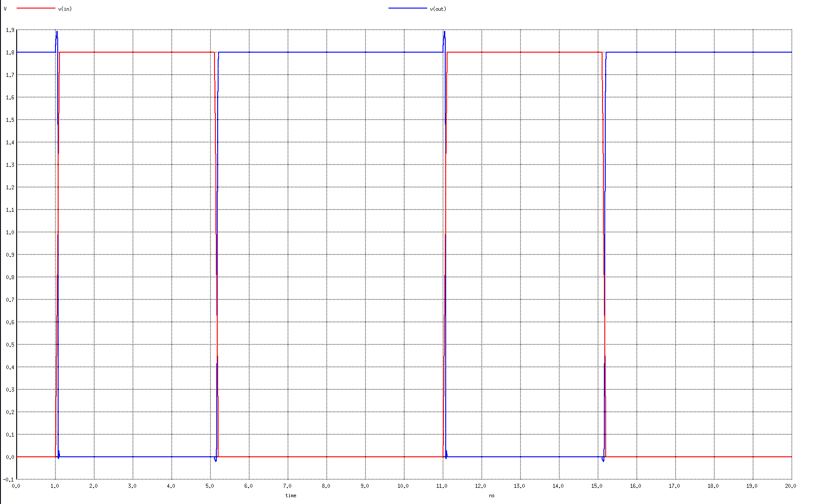

# CMOS Inverter
This is a CMOS Inverter based on SkyWater 130nm that I designed using KLayoout. I did this too taught myself the real skills of designing a chip.

## Process
1. First, I straight up draw the layout without doing the schematic and set up the netlist first because I don't know any better.
2. After I've done with layout, I run DRC and LVS to make sure the design follow the standard set by SkyWater and the layout work as intended by schematic
3. Then I run simulation to ensure the circuit works correctly using NGSpice. Below are the result:

